# OpenPulse AI 总体架构 v0.1

## 架构目标

第一版采用“单仓库 + 模块化单体 + 独立 C++ 分析器”。

- **单仓库（Monorepo）**：Java、C++、前端和协议放在同一个 Git 仓库，方便两个人同步接口和版本。
- **模块化单体**：Java 后端先作为一个可部署程序，但内部按业务模块隔离。它比微服务更容易开发和部署，同时保留以后拆分的可能。
- **独立分析器**：C++ 是单独的命令行程序。Java 通过命令和 JSON 协议调用它，不直接依赖 C++ 内部代码。

“可扩展”不是提前堆很多组件，而是模块职责清楚、依赖方向稳定、关键行为有测试。

## 系统关系

```mermaid
flowchart LR
    U["用户"] --> W["Vue Web"]
    W -->|"HTTP / JSON"| J["Java Platform"]
    J --> G["GitHub API"]
    J --> D[("MySQL")]
    J -->|"CLI + JSON 协议"| C["C++ Analyzer"]
    J --> A["AI Provider"]
    C --> R["本地仓库副本"]
```



Java 是业务流程的唯一协调者：创建任务、下载仓库、调用分析器、保存报告、计算评分、调用 AI，并把结果提供给前端。

## Java 模块边界

建议按业务能力组织代码，不建立一个装下全项目所有 `controller`、`service`、`repository` 的大目录。

```text
openpulse-platform/
  src/main/java/.../openpulse/
    project/          仓库项目与 GitHub 元数据
    analysis/         分析任务、状态和调度
    report/           报告、风险和健康评分
    advisor/          AI 总结与建议
    integration/
      github/         GitHub API 适配
      analyzer/       C++ 进程调用与 JSON 解析
      ai/             AI 服务适配
    shared/           少量真正跨模块的通用能力
```

每个业务模块内部可以逐步包含：

- `api`：HTTP 请求、响应和参数校验
- `application`：编排一个用例，例如“创建分析任务”
- `domain`：核心业务规则和状态
- `infrastructure`：数据库、外部 API、文件和进程实现

这是一种简化的分层设计。外部工具可以替换，但核心业务规则不应依赖具体数据库或 AI 厂商。

## C++ 边界

C++ 分析器只负责读取指定目录、执行规则、输出约定 JSON：

```text
openpulse-analyzer/
  src/
  include/
  tests/
  rules/
```

它不连接 Java 数据库，不处理用户登录，也不调用 AI。Java 和 C++ 的共同边界只有：

1. 命令行参数
2. 退出码
3. JSON 报告
4. 协议版本

协议以 `docs/02-analyzer-json-protocol.md` 为准。

## 最小业务流程

1. 前端提交 GitHub 公共仓库地址。
2. Java 校验地址并创建分析任务。
3. Java 获取仓库信息并下载代码到隔离的临时目录。
4. Java 启动 C++ 分析器，设置超时并记录退出码。
5. C++ 写出报告，Java 按协议校验并保存。
6. Java 计算健康评分，再请求 AI 生成解释。
7. 前端轮询任务状态并展示最终报告。
8. Java 清理临时仓库，保留可追踪的任务日志。

## 质量底线

- 安全：Token 只从环境变量读取，不写入 Git；外部输入必须校验；扫描进程要有限时和目录限制。
- 可测试：业务规则写单元测试；数据库、GitHub、C++ 和 AI 通过边界接口替换为测试实现。
- 可观测：每个分析任务有唯一 `taskId`；日志记录阶段、耗时和失败原因，但不记录密钥。
- 可迁移：数据库迁移使用版本脚本；API 和分析器协议带版本。
- 可部署：开发期本地运行，形成闭环后再加入 Docker Compose 和 CI。

## 暂不采用微服务

微服务会立刻增加服务发现、网络错误、部署、日志追踪和数据一致性成本。当前只有两位开发者，一个模块化 Java 程序已经能提供清晰边界。将来只有在某个模块需要独立扩容、独立发布或由独立团队维护时，才评估拆分。
