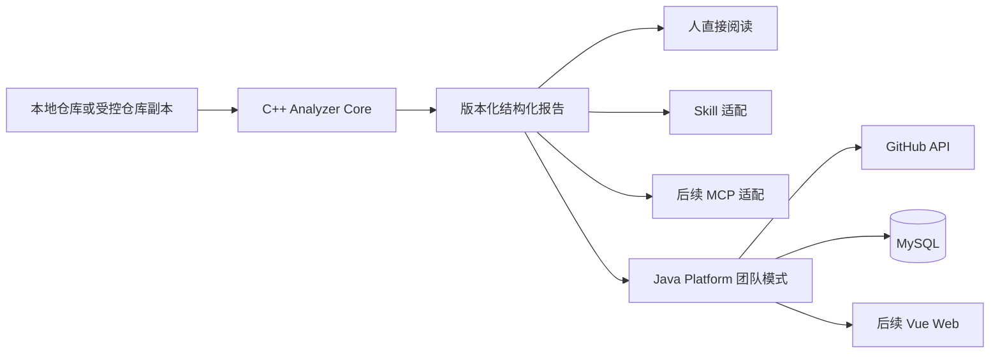

# OpenPulse AI 总体架构 v0.2

## 架构目标

v0.2 采用“单仓库 + 本地分析核心 + 多个薄适配入口 + 可选团队服务”。

- **单仓库（Monorepo）**：Java、C++、前端和协议放在同一个 Git 仓库，方便两个人同步接口和版本。
- **本地分析核心**：C++ 命令行程序独立读取本地仓库并输出确定性报告，不依赖网站、数据库或 AI。
- **薄适配入口**：CLI、Skill、MCP、GitHub Action 和网站只能复用同一分析核心，不能各自实现一套规则。
- **可选团队服务**：Java 继续使用模块化单体，负责 GitHub 获取、进程编排、任务历史和报告持久化；Vue 是团队模式入口，不是本地分析的前置条件。

“可扩展”不是提前堆很多组件，而是模块职责清楚、依赖方向稳定、关键行为有测试。

## 系统关系



产品只有一个分析事实来源：C++ Analyzer Core。AI 只能解释已生成的事实和证据，不能替代规则引擎产生未经验证的结论。

## 使用模式与优先级

### 1. 本地直接使用

```text
用户安装 OpenPulse -> 分析本地目录 -> 查看终端摘要或 JSON 报告
```

这是 v0.2 第一优先级，也是其他入口共同依赖的基础。

### 2. AI Skill 使用

```text
用户请求 AI 检查仓库 -> Skill 运行本地分析器 -> AI 读取摘要 -> 按需读取具体证据
```

Skill 只包含调用和解释规范，不包含另一套扫描逻辑。不同 AI 产品的 Skill 格式不一定通用，v0.2 先验证一个 Codex Skill。只有测量后才能声称节省 Token 或提高准确率。

### 3. MCP 使用

MCP 在本地产品和 Skill 验证通过后再开发。它负责把分析、发现列表和证据查询暴露为 AI 可以调用的工具。

### 4. 团队与网站使用

```text
用户提交 GitHub 地址 -> Java 受控下载 -> C++ 生成同一格式报告 -> MySQL 保存 -> Web 展示历史
```

这一模式复用现有 Java 能力，但不属于 v0.2 第一验证阶段。

## Java 模块边界

建议按业务能力组织代码，不建立一个装下全项目所有 `controller`、`service`、`repository` 的大目录。

```text
openpulse-platform/
  src/main/java/.../openpulse/
    project/          仓库项目与 GitHub 元数据
    analysis/         分析任务、状态和调度
    report/           报告、发现和证据
    integration/
      github/         GitHub API 适配
      analyzer/       C++ 进程调用与 JSON 解析
    shared/           少量真正跨模块的通用能力
```

每个业务模块内部可以逐步包含：

- `api`：HTTP 请求、响应和参数校验
- `application`：编排一个用例，例如“创建分析任务”
- `domain`：核心业务规则和状态
- `infrastructure`：数据库、外部 API、文件和进程实现

这是一种简化的分层设计。外部工具可以替换，但核心业务规则不应依赖具体数据库或 AI 厂商。

## C++ 边界

C++ 分析器只负责读取指定目录、执行规则、输出约定报告：

```text
openpulse-analyzer/
  src/
  include/
  tests/
  rules/
```

它不连接 Java 数据库，不处理用户登录，也不调用 AI。Java 和 C++ 的共同边界只有：

1. 命令行参数
2. 退出码
3. JSON 报告
4. 协议版本

协议以 `docs/02-analyzer-json-protocol.md` 为准。

C++ 可以逐步使用 Tree-sitter 获得语法树能力，但每种语言和规则必须有测试样例。v0.2 如果增加语法树规则，先限定 Java 和 C++；没有语法依据时，只能把结果描述为文件或文本规则，不能宣传成深度语义分析。

## v0.2 最小业务流程

1. 用户选择一个本地仓库。
2. OpenPulse 校验路径、大小和排除目录。
3. C++ 分析器生成带版本的结构化报告。
4. 每条发现给出规则编号、位置、证据和修复方向。
5. 用户直接阅读报告，或由一个 Skill 让 AI 按需解释。
6. 使用真实仓库记录稳定性、耗时、误报和 AI 上下文消耗。

## 质量底线

- 安全：本地优先且默认不上传源码；外部输入必须校验；扫描进程要有限时和目录限制；证据片段进入 AI 前必须可控并去除敏感信息。
- 可测试：业务规则写单元测试；数据库、GitHub、C++ 和 AI 通过边界接口替换为测试实现。
- 可观测：每个分析任务有唯一 `taskId`；日志记录阶段、耗时和失败原因，但不记录密钥、源码正文或不必要的绝对路径。
- 可迁移：数据库迁移使用版本脚本；API 和分析器协议带版本。
- 可分发：先证明新用户能够安装本地 CLI 并生成报告，再考虑 Docker Compose、网站和团队部署。

## 暂不采用微服务

微服务会立刻增加服务发现、网络错误、部署、日志追踪和数据一致性成本。当前只有两位开发者，一个模块化 Java 程序已经能提供清晰边界。将来只有在某个模块需要独立扩容、独立发布或由独立团队维护时，才评估拆分。
